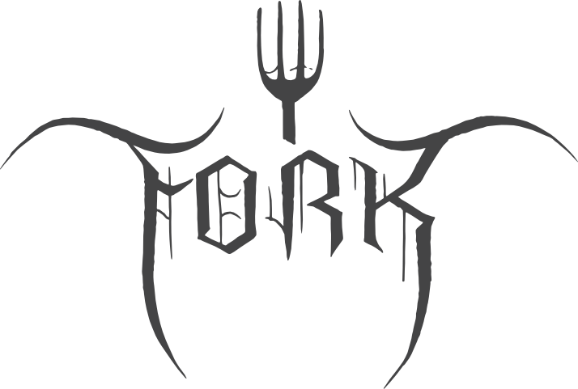

# GUI

### What is Git GUI ?

**Git Graphical User Interface (GUI)** clients is a tools that provide alternative visualization for Git. As you know for beginner developer they want to use Git but it also has a high learning curve, To make it easier for new developer, They have created Git Graphical User Interface clients for various platform.

### My recommendation

#### **1. Sourcetree**: A free Git client for Windows and Mac

Sourcetree is a free Git desktop client. It simplifies how you interact with your Git repositories. Visualize and manage your repositories through Sourcetree's simple Git GUI.

#### Feature

* Review you outgoing and incoming changesets, cherry-pick between branches, patch handling, rebase, stash, and much more.
* Create, clone, commit, push, pull, merge and more than this are do only just a click
* Use Git-flow with ease. Keep your repositories cleaner and make you development more easier.
* Visualize you Git history
* Clone private repositories in free plan
* View different of changed file
* Interactive rebase for clean commit of Git history

#### Pricing: Free

#### Operating System:&#x20;

* Windows
* MacOS

#### License: Atlassian

#### [Download](https://www.sourcetreeapp.com)

####

#### 2. GitKraken: Legendary Git GUI client for Windows, Mac and Linux

#### Feature

* Review your incoming changeset, handling rebase, stash, commit, push, pull, merge and much more.
* Useful keyboard shortcuts for repositories action
* Adjusting the UI
* Visualize commit history to see whatever have been changed
* View different of current and history
* Avoid and safely to resolve merge conflicts
* Have GitKraken CLI

#### Pricing: Free / Premium Paid

#### Operating System:

* Windows
* MacOS
* Linux

#### License: Proprietary

#### [Download](https://www.gitkraken.com)

#### 3. Fork

#### Feature

* Basic feature like fetch, push, pull, commit, amend, stash, merge, rebase, cherry-pick and much more.
* Work with repository easier by open recently repository
* Visualize Git history to see changed file
* Find the last commit which changed a particular file line
* Edit, Reorder and squash you commits by using visual interactive rebase.
* Intuitive merge conflict and resolving
* Restore lost commits with Reflog
* Stage / Unstaged changes line by line
* Access to recent commit messages

#### Pricing: Free/ Paid plan

#### Operating System

* Windows
* MacOS

#### License: Proprietary

#### [Download](https://git-fork.com)
